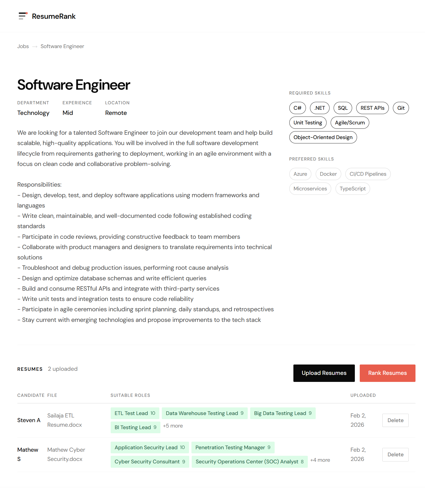
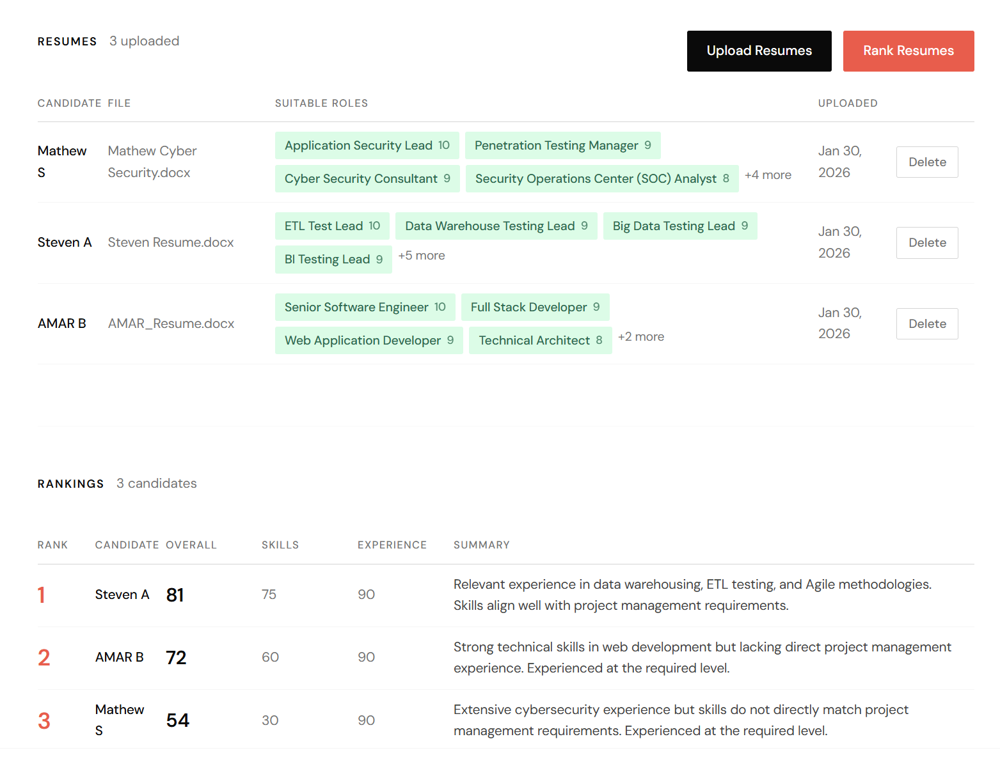

# ResumeRank

A resume ranking application that uses AI agents to parse and score resumes against job requirements.

## Features

- **Resume Parsing**: Upload PDF/DOCX resumes and extract structured data (skills, experience, summary)
- **Job Matching**: Define job descriptions with required and preferred skills
- **AI-Powered Ranking**: Score and rank candidates based on job requirements using LLM
- **Web Interface**: User-friendly Razor Pages frontend for managing jobs and resumes
- **AWS Integration**: Deploy agents to AWS Lambda with S3 storage and API Gateway

## Screenshots

### Job description with uploaded resumes



Job detail page showing the job title, description, required and preferred skills, and the list of resumes uploaded for that job. You can upload PDF/DOCX files and run AI-powered ranking from here.

### Ranking results



AI-generated ranking of candidates for the selected job. Each resume is scored and ordered by fit, with a short rationale. Use this view to compare candidates and decide who to interview.

## Architecture

The application consists of three components:

| Component | Technology | Port | Description |
|-----------|------------|------|-------------|
| Web App | .NET 8 ASP.NET Core | 5016 | Razor Pages frontend |
| Resume Parser Agent | Python FastAPI | 5100 | Extracts structured data from resumes |
| Ranking Agent | Python FastAPI | 5101 | Scores resumes against job criteria |

### Local Architecture

```
┌─────────────────────────────────────────────────────────────────┐
│                           Browser                               │
└─────────────────────────────┬───────────────────────────────────┘
                              │ HTTP
                              ▼
┌─────────────────────────────────────────────────────────────────┐
│                    .NET Web Application                         │
│                   (ASP.NET Core - Port 5016)                    │
│  ┌─────────────┐  ┌─────────────┐  ┌─────────────────────────┐  │
│  │ Razor Pages │  │  Services   │  │    SQLite Database      │  │
│  └─────────────┘  └──────┬──────┘  └─────────────────────────┘  │
└──────────────────────────┼──────────────────────────────────────┘
                           │ HTTP
              ┌────────────┴────────────┐
              ▼                         ▼
┌───────────────────────┐   ┌───────────────────────┐
│  Resume Parser Agent  │   │    Ranking Agent      │
│  (FastAPI - Port 5100)│   │  (FastAPI - Port 5101)│
│  ┌─────────────────┐  │   │  ┌─────────────────┐  │
│  │ PDF/DOCX Parser │  │   │  │   LLM Service   │  │
│  └─────────────────┘  │   │  └─────────────────┘  │
└───────────────────────┘   └───────────────────────┘
```

### AWS Architecture

```
┌─────────────────────────────────────────────────────────────────┐
│                           Browser                               │
└─────────────────────────────┬───────────────────────────────────┘
                              │ HTTP
                              ▼
┌─────────────────────────────────────────────────────────────────┐
│                .NET Web Application (Local)                     │
│                   (ASP.NET Core - Port 5016)                    │
│  ┌─────────────┐  ┌─────────────┐  ┌─────────────────────────┐  │
│  │ Razor Pages │  │  Services   │  │    SQLite Database      │  │
│  └─────────────┘  └──────┬──────┘  └─────────────────────────┘  │
└──────────────────────────┼──────────────────────────────────────┘
                           │ HTTPS
                           ▼
┌─────────────────────────────────────────────────────────────────┐
│                      AWS API Gateway                            │
│              POST /parse          POST /rank                    │
└─────────────┬───────────────────────────────┬───────────────────┘
              │                               │
              ▼                               ▼
┌───────────────────────┐       ┌───────────────────────┐
│  Resume Parser Lambda │       │    Ranking Lambda     │
│  ┌─────────────────┐  │       │  ┌─────────────────┐  │
│  │ PDF/DOCX Parser │  │       │  │  AWS Bedrock    │  │
│  │ + AWS Bedrock   │  │       │  │  (Claude)       │  │
│  └────────┬────────┘  │       │  └─────────────────┘  │
└───────────┼───────────┘       └───────────────────────┘
            │
            ▼
┌───────────────────────┐
│      S3 Bucket        │
│  (Resume Storage)     │
└───────────────────────┘
```

## Prerequisites

- [.NET 8 SDK](https://dotnet.microsoft.com/download/dotnet/8.0)
- [Python 3.10+](https://www.python.org/downloads/)
- LLM API Key (Anthropic for local mode)

### Additional for AWS Deployment

- [AWS CLI](https://aws.amazon.com/cli/) configured with appropriate credentials
- [Terraform](https://www.terraform.io/downloads) >= 1.0
- AWS Bedrock Claude model access enabled in your AWS account

## Setup

### 1. Clone the repository

```bash
git clone https://github.com/skizha/ResumeRank.git
cd ResumeRank
```

### 2. Install Python dependencies

```bash
pip install -r src/agents/requirements.txt
```

### 3. Configure environment

Set your LLM API key (for local mode):

```bash
# Windows
set ANTHROPIC_API_KEY=your-api-key-here

# Linux/Mac
export ANTHROPIC_API_KEY=your-api-key-here
```

### 4. Build the .NET application

```bash
dotnet build
```

## Running Locally

You need to run all three components:

### Terminal 1 - Resume Parser Agent

```bash
cd src/agents
python -m uvicorn resume_parser.main:app --port 5100
```

### Terminal 2 - Ranking Agent

```bash
cd src/agents
python -m uvicorn ranking_agent.main:app --port 5101
```

### Terminal 3 - Web Application

```bash
dotnet run --project src/ResumeRank.Web
```

Open http://localhost:5016 in your browser.

## AWS Deployment

### 1. Deploy Infrastructure and Lambda Functions

```powershell
# Package and deploy
.\scripts\deploy-aws.ps1

# Or with custom options
.\scripts\deploy-aws.ps1 -Environment prod -Region us-west-2 -AutoApprove
```

### 2. Configure the .NET Application

Update `src/ResumeRank.Web/appsettings.json` or create `appsettings.Production.json`:

```json
{
  "AgentMode": "AWS",
  "AWS": {
    "Region": "us-east-1",
    "ApiGatewayUrl": "https://YOUR_API_ID.execute-api.us-east-1.amazonaws.com/dev",
    "S3BucketName": "resumerank-resumes-dev-YOUR_ACCOUNT_ID"
  }
}
```

The deployment script will output the correct values for `ApiGatewayUrl` and `S3BucketName`.

### 3. Run with AWS Mode

```bash
# Using environment variable
set AgentMode=AWS
dotnet run --project src/ResumeRank.Web

# Or use Production environment
dotnet run --project src/ResumeRank.Web --environment Production
```

### 4. Tear Down AWS Resources

```powershell
.\scripts\destroy-aws.ps1

# Force destroy including S3 contents
.\scripts\destroy-aws.ps1 -Force -AutoApprove
```

## Configuration Modes

The application supports two modes configured via `AgentMode` in appsettings:

| Mode | Description | File Storage | Agent Endpoints |
|------|-------------|--------------|-----------------|
| `Local` (default) | Local development | Local filesystem | FastAPI on localhost |
| `AWS` | Cloud deployment | Amazon S3 | API Gateway + Lambda |

### Local Mode Configuration

```json
{
  "AgentMode": "Local",
  "AgentServices": {
    "ResumeParserUrl": "http://localhost:5100",
    "RankingAgentUrl": "http://localhost:5101"
  },
  "FileStorage": {
    "UploadPath": "uploads"
  }
}
```

### AWS Mode Configuration

```json
{
  "AgentMode": "AWS",
  "AWS": {
    "Region": "us-east-1",
    "ApiGatewayUrl": "https://xxx.execute-api.us-east-1.amazonaws.com/dev",
    "S3BucketName": "resumerank-resumes-dev-123456789012"
  }
}
```

## Project Structure

```
ResumeRankV1/
├── infrastructure/              # Terraform AWS configs
│   ├── main.tf
│   ├── variables.tf
│   ├── outputs.tf
│   ├── s3.tf
│   ├── lambda.tf
│   ├── api_gateway.tf
│   └── iam.tf
├── scripts/                     # Deployment scripts
│   ├── deploy-aws.ps1
│   ├── destroy-aws.ps1
│   └── package-lambda.ps1
├── src/
│   ├── ResumeRank.Web/          # .NET 8 ASP.NET Core Razor Pages
│   │   ├── Pages/               # Razor Pages
│   │   ├── Models/              # Data models
│   │   ├── Services/            # Business logic and HTTP clients
│   │   └── Data/                # EF Core DbContext
│   └── agents/
│       ├── resume_parser/       # Local FastAPI resume parser
│       ├── ranking_agent/       # Local FastAPI ranking agent
│       ├── shared/              # Shared configuration
│       └── aws_lambda/          # AWS Lambda handlers
│           ├── resume_parser/   # Lambda resume parser
│           ├── ranking_agent/   # Lambda ranking agent
│           └── shared/          # Shared AWS utilities
├── tests/
│   ├── ResumeRank.Web.Tests/    # xUnit tests
│   └── agents/                  # pytest tests
└── ResumeRank.sln               # .NET solution file
```

## API Endpoints

### Resume Parser Agent (port 5100 / /parse)

| Method | Endpoint | Description |
|--------|----------|-------------|
| POST | `/parse` | Parse a resume file |
| GET | `/health` | Health check |

### Ranking Agent (port 5101 / /rank)

| Method | Endpoint | Description |
|--------|----------|-------------|
| POST | `/rank` | Rank resumes against a job |
| GET | `/health` | Health check |

## Testing

### .NET Tests

```bash
dotnet test
```

### Python Tests

```bash
pytest tests/agents/ -v
```

### Test AWS Lambda Functions

```bash
# Test parser directly
aws lambda invoke --function-name resumerank-parser-dev \
  --payload '{"file_path":"resumes/job-1/test.pdf"}' response.json

# Test ranking directly
aws lambda invoke --function-name resumerank-ranking-dev \
  --payload '{"resumes":[...],"job":{...}}' response.json

# Test via API Gateway
curl -X POST https://xxx.execute-api.us-east-1.amazonaws.com/dev/parse \
  -H "Content-Type: application/json" \
  -d '{"file_path":"resumes/job-1/test.pdf"}'
```

## AWS Services Used

| Service | Purpose |
|---------|---------|
| S3 | Store uploaded resume files (PDF/DOCX) |
| Lambda | Resume Parser and Ranking Agent functions |
| API Gateway | REST API endpoints for Lambda invocation |
| Bedrock | Claude LLM for AI processing |
| IAM | Roles and policies for service access |
| CloudWatch | Logging and monitoring |

## License

MIT
