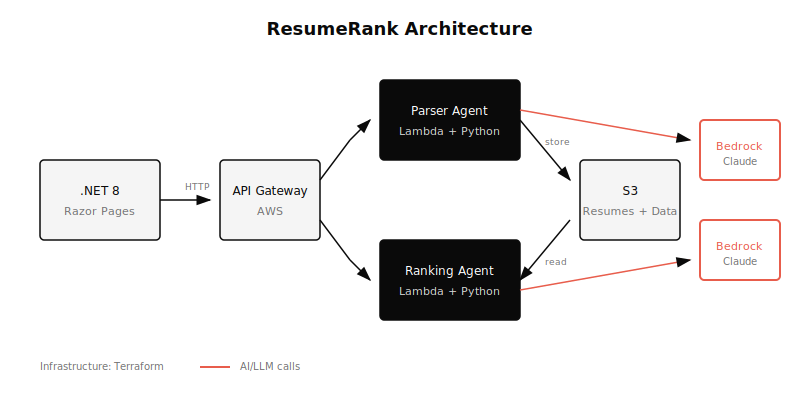

# From Neural Networks to AI Agents: Rebuilding Resume Screening 10 Years Later

Back in 2015, I built a resume ranking system the hard way. We used NLTK for natural language processing, vectorization for semantic matching, and neural networks to build a knowledge graph of job descriptions. A partner company scraped thousands of JDs, which we fed into the system to train it on what "good matches" looked like.

The project took 6 months to build. Chunking text properly was an art. Grammar parsing was finicky. And the training cycles were brutal—one week's worth of new job descriptions required two weeks to update the language model.

Then there were the biases. When too many similar JDs came through, the model skewed heavily toward that pattern. Cleaning and normalizing data was a constant battle.

Fast forward to 2024. I rebuilt the entire thing with AI agents. What took 6 months now took weeks. What took two weeks to retrain takes zero—the model adapts on the fly. And the results are significantly better.

Here's how it works now.

---

## The Problem (Still) Exists

If you've ever screened resumes for a technical role, you know the drill. Two hundred applications land in your inbox. You need to find the ten worth interviewing.

Manual screening takes days. Keyword matching is too crude—"5 years Python experience" doesn't tell you if someone can architect distributed systems or just wrote automation scripts. And identifying transferable skills? That requires careful reading that doesn't scale.

The problem hasn't changed. But the tools have.

---

## The New Approach: AI Agents

ResumeRank uses two AI agents working in sequence:

### Agent 1: The Resume Parser

Takes a PDF or DOCX resume and extracts structured data. Not just keywords—context. Work history with responsibilities, skills with inferred proficiency levels, education, certifications.

But here's the interesting part: it also identifies suitable roles the candidate could fill. Each role gets a suitability score from 1-10 based on the candidate's background.

### Agent 2: The Ranking Agent

Compares all parsed resumes against specific job requirements. This isn't keyword matching—it's semantic understanding. The agent scores candidates on:
- **Skill match**: Do they have what the job needs?
- **Experience relevance**: Is their background applicable?
- **Overall fit**: Holistic assessment with reasoning

The output is a ranked list with scores and a summary explaining why each candidate placed where they did.

---

## The Architecture



The system runs entirely serverless on AWS:

```
Resume (PDF/DOCX) → API Gateway → Parser Lambda → S3 (structured data)
                                                        ↓
Job Requirements  → API Gateway → Ranking Lambda → Ranked Results
                                       ↑
                              (reads parsed data from S3)
```

### Tech Stack

| Component | Technology |
|-----------|------------|
| Frontend | .NET 8 Razor Pages |
| AI Agents | Python + AWS Bedrock (Claude) |
| Compute | AWS Lambda |
| Storage | S3 |
| API | API Gateway |
| Infrastructure | Terraform |

### Why This Stack?

**Serverless Lambda** means no servers to manage. Upload a resume, Lambda spins up, processes it, shuts down. Pay only for what you use.

**AWS Bedrock** gives access to Claude without hosting models. No GPU provisioning, no model management. Just API calls. For a tool that might process 50 resumes one week and 500 the next, this elasticity matters.

**Terraform** makes the infrastructure reproducible. One command deploys everything—Lambda functions, API Gateway routes, S3 buckets, IAM roles.

---

## A Code Snippet: The Parser Prompt

The core of the parser agent is the prompt. Here's a simplified version:

```python
def parse_resume(resume_text: str) -> dict:
    prompt = f"""
    Extract structured data from this resume:

    {resume_text}

    Return JSON with:
    - candidate_name
    - skills (list with proficiency: beginner/intermediate/advanced)
    - experience (list of roles with company, duration, responsibilities)
    - education
    - suitable_roles (list of roles this person would excel at,
      each with a suitability_score from 1-10 and reasoning)
    """

    response = bedrock.invoke_model(
        modelId="anthropic.claude-3-sonnet",
        body=json.dumps({"prompt": prompt})
    )

    return json.loads(response["completion"])
```

Getting consistent, structured JSON output took iteration. Few-shot examples in the prompt helped more than anything else.

---

## What Surprised Me

The "suitable roles" feature wasn't in the original plan. I added it almost as an afterthought—"while you're parsing, suggest what roles this person would be good for."

The results were genuinely useful.

*[Screenshot: Suitable roles with scores]*

A resume that looked like a standard "Backend Developer" application got flagged as a strong fit for "DevOps Engineer" (score: 8/10) and "Platform Engineer" (score: 7/10) based on their Kubernetes, Terraform, and CI/CD pipeline experience.

That's the kind of insight that takes a human recruiter 15 minutes of careful reading. The agent does it in seconds.

---

## The Rankings in Action

*[Screenshot: Ranking results table]*

Each candidate gets:
- **Overall score**: Weighted combination of factors
- **Skill match score**: Technical fit
- **Experience match score**: Background relevance
- **Summary**: Plain-English explanation of the ranking

No black box. You can see why someone ranked where they did.

---

## For Recruiters: What This Means

You're not being replaced. You're being augmented.

AI handles the first pass—parsing, scoring, ranking. You still make the final calls. But instead of spending days filtering 200 resumes down to 20, you spend 30 minutes reviewing the AI's top 20 with context on *why* they ranked high.

The suitable roles feature also enables talent pooling. Candidate applied for Role A but would be perfect for Role B? Now you know before you pass on them.

Time savings: Days of scanning → minutes of filtering.

---

## For Developers: Build This Yourself

The architecture is straightforward to replicate:

1. **Pick your LLM**: Bedrock, OpenAI, Anthropic API, or local models
2. **Design your prompts**: This is the hard part—getting consistent structured output
3. **Build the orchestration**: Lambda, containers, or simple scripts
4. **Add a UI**: Razor Pages, React, or even a CLI

Tips from building this:
- **JSON mode** helps with structured output
- **Few-shot examples** in prompts dramatically improve consistency
- **Validate outputs** before storing—LLMs occasionally return malformed JSON
- **Keep prompts versioned**—you'll iterate on them constantly

---

## A Note on How This Was Built

The code for this project was written with AI assistance—specifically Claude via Claude Code. The architecture design, implementation, debugging, and even this article were collaborative efforts between human direction and AI execution.

It's a fitting meta-layer: an AI-powered tool for ranking resumes, built with AI-powered coding assistance.

---

## Try It Yourself

The full source code is available on GitHub: **[github.com/skizha/ResumeRank](https://github.com/skizha/ResumeRank)**

What's your experience with AI in hiring workflows? Already using it? Skeptical about the results? I'd like to hear what's working—or not—for your team.

---

*[Optional: Add screenshots of ranking results and suitable roles UI]*
