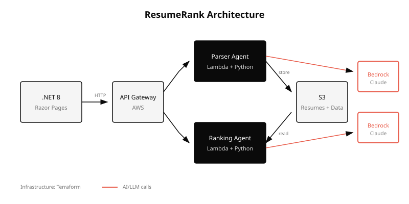

# From Neural Networks to AI Agents: Rebuilding Resume Screening 10 Years Later

Back in 2015, we built a resume ranking system the hard way. We used NLTK for natural language processing, vectorization for semantic matching, and neural networks to build a knowledge graph of job descriptions. A partner company scraped thousands of JDs, which we fed into the system to train it on what "good matches" looked like.

The project took months. Chunking text properly was an art. Grammar parsing was finicky. And the training cycles were brutal one week's worth of new job descriptions required two weeks to update the language model. Data cleanup was a constant headache.

Then there were the biases. When too many similar JDs came through, the model skewed heavily toward that pattern. Normalizing data was a constant battle.

Fast forward to 2026. We rebuilt the whole thing with AI agents. What took 8-9 months the first time took weeks. Retraining which used to eat two weeks is gone entirely; the model adapts as it runs. And honestly, the results are better than I expected.

Here's how it works now.

---

## The problem (still) exists

If you've ever screened resumes for a technical role, you know the drill. Two hundred applications land in your inbox. You need to find the ten worth interviewing.

Manual screening takes days. Keyword matching is too crude - "5 years Python experience" doesn't tell you if someone can architect distributed systems or just wrote automation scripts. And identifying transferable skills? That requires careful reading that doesn't scale.

The problem hasn't changed. But the tools have.

---

## The new approach: AI agents

ResumeRank uses two AI agents working in sequence.

### Agent 1: The Resume Parser

Takes a PDF or DOCX resume and extracts structured data. Not just keywords context. Work history with responsibilities, skills with inferred proficiency levels, education, certifications.

But here's the part I didn't expect to work as well as it does: the agent also identifies suitable roles the candidate could fill. Each role gets a suitability score from 1-10 based on their actual background.

### Agent 2: The Ranking Agent

Compares all parsed resumes against specific job requirements. This isn't keyword matching it's semantic understanding. The agent scores candidates on skill match (do they have what the job needs), experience relevance (is their background actually applicable), and overall fit, with a plain-English explanation of the reasoning.

The output is a ranked list with scores and a summary explaining why each candidate placed where they did.

---

## The architecture



The system runs entirely serverless on AWS:

```
Resume (PDF/DOCX) → API Gateway → Parser Lambda → S3 (structured data)
                                                        ↓
Job Requirements  → API Gateway → Ranking Lambda → Ranked Results
                                       ↑
                              (reads parsed data from S3)
```

### Tech stack

| Component | Technology |
|-----------|------------|
| Frontend | .NET 8 Razor Pages |
| AI Agents | Python + AWS Bedrock (Claude) |
| Compute | AWS Lambda |
| Storage | S3 |
| API | API Gateway |
| Infrastructure | Terraform |

### Why this stack?

Serverless Lambda means no servers to manage. Upload a resume, Lambda spins up, processes it, shuts down. You pay for what you use which matters when load is unpredictable.

AWS Bedrock gives access to Claude without hosting models. No GPU provisioning, no model management, just API calls. For a tool that might process 50 resumes one week and 500 the next, that elasticity matters more than cost optimization.

Terraform makes the infrastructure reproducible. One command deploys everything: Lambda functions, API Gateway routes, S3 buckets, IAM roles.

---

## A code snippet: the parser prompt

The core of the parser agent is the prompt. Here's a simplified version:

```python
def parse_resume(resume_text: str) -> dict:
    prompt = f"""
    Extract structured data from this resume:

    {resume_text}

    Return JSON with:
    - candidate_name
    - skills (list with proficiency: beginner/intermediate/advanced)
    - experience (list of roles with company, duration, responsibilities)
    - education
    - suitable_roles (list of roles this person would excel at,
      each with a suitability_score from 1-10 and reasoning)
    """

    response = bedrock.invoke_model(
        modelId="anthropic.claude-3-sonnet",
        body=json.dumps({"prompt": prompt})
    )

    return json.loads(response["completion"])
```

Getting consistent, structured JSON output took iteration. Few-shot examples in the prompt helped more than anything else.

---

## What surprised me

The "suitable roles" feature wasn't in the original plan. I added it almost as an afterthought "while you're parsing, suggest what roles this person would be good for."

The results were genuinely useful.

*[Screenshot: Suitable roles with scores]*

A resume that looked like a standard "Backend Developer" application got flagged as a strong fit for "DevOps Engineer" (score: 8/10) and "Platform Engineer" (score: 7/10) based on their Kubernetes, Terraform, and CI/CD pipeline experience.

That's the kind of insight that takes a human recruiter 15 minutes of careful reading. The agent does it in seconds.

---

## The rankings in action

*[Screenshot: Ranking results table]*

Each candidate gets an overall score, a skill match score, an experience match score, and a plain-English summary explaining the ranking.

No black box. You can see exactly why someone placed where they did.

---

## For recruiters

You're not being replaced you're getting a faster first pass.

AI handles the initial filtering: parsing, scoring, ranking. You still make the final calls. But instead of spending days working through 200 resumes to find the 20 worth reading, you spend 30 minutes reviewing the AI's shortlist with actual reasoning attached.

The suitable roles feature also opens up talent pooling. Candidate applied for Role A but would be a better fit for Role B? Now you know before you pass on them.

---

## For developers: build this yourself

The architecture is straightforward to replicate:

1. Pick your LLM—Bedrock, OpenAI, Anthropic API, or local models
2. Design your prompts. This is the hard part: getting consistent structured output takes more iteration than you'd expect
3. Build the orchestration—Lambda, containers, or simple scripts
4. Add a UI—Razor Pages, React, or even a CLI

A few things I learned the hard way:
- **JSON mode** helps with structured output
- **Few-shot examples** in prompts dramatically improve consistency—more than system prompt instructions alone
- **Validate outputs** before storing—LLMs occasionally return malformed JSON
- **Keep prompts versioned**—you'll iterate on them constantly

---

## A note on how this was built

The code for this project was written with AI assistance specifically Claude via Claude Code. Architecture design, implementation, debugging, and this article were all collaborative: human direction, AI execution.

There's something a little strange about an AI-powered resume tool built with AI-powered coding assistance. I haven't fully decided how I feel about it.

---

## Try it yourself

Full source code: **[github.com/skizha/ResumeRank](https://github.com/skizha/ResumeRank)**

What's your experience with AI in hiring workflows? Already using it, or skeptical about where the errors show up? I'd like to hear what's actually working or not for your team.

---

*[Optional: Add screenshots of ranking results and suitable roles UI]*
